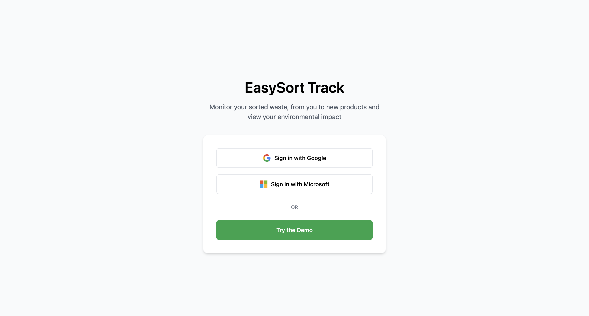

# easytrack (track.easysort.org)

Below are some of the requirements for the full app. The current version (branch: `mvp`) is extremely simplified and missing key features. This project should replace the current `mvp` branch.

## Version 0: Design:

### Intro page:

(This is a mockup, the actual page may differ)

The user should be able to login using either Google OAuth or Microsoft OAuth. There should not be custom login options.

The user can also try a demo account. The demo page (and the page after login) should simply display the email of the user after they are logged in.

## Requirements:

Why:
The Residual Waste Overview Page is a customer-facing web page designed to provide a clear, concise, and intuitive overview of the company’s waste-sorting efforts. The page must display essential information about how much waste has been sorted, how it is categorized, where it originates from within the organization, and how much CO₂ has been saved. The primary objective is to enable customers (and relevant stakeholders) to quickly grasp the company’s sustainability impact in a visually appealing and easy-to-understand manner.

What:
The page should include the following information for the customer to see:
- How much waste has been sorted
- How has this waste been sorted: What are the fractions they have been sorted in and how much of each
- Where is the waste coming from around the company (library, events, dtu compute buildings, etc.)
- How much CO2 has been saved?
- Money spent: $ per kg CO2 saved - compare that to average across easysort and to other usual efforts for companies to reduce co2.

All of this information should be pulled from our database using the email of the user. For now we can work with mock data while we test.

Objectives:
- Ensure users can immediately comprehend the waste data with minimal to no learning curve.
- Offer a complete breakdown of sorted waste types and origins.
- There should be a login page to access the page.
- It should be built using tailwind and bun
- It should have a raw look to it.

1. Total Waste Sorted

A clear display (e.g., a large, prominent number or card) showing total volume or weight of waste sorted in a chosen timeframe (e.g., monthly, quarterly, annually).

2. Waste Sorting Breakdown

Visual representation (e.g., pie chart, bar chart) of different waste fractions/categories (e.g., Paper, Plastic, Organic, Residual, etc.).
Percentage or weight for each fraction.
Hover or tap interactivity for more details (optional depending on design simplicity).

3. Origin of Waste

A listing or map-like view that indicates major locations/departments (e.g., library, events, DTU Compute buildings).
Each location’s contribution to total waste (e.g., 30% from library, 20% from events).

4. CO₂ Savings

Numerical value or indicator showing total estimated CO₂ savings based on the waste sorted.
Brief explanation or tool-tip on how CO₂ savings are calculated (if needed for transparency).

5. Time-Period Filters (Optional/Phase 2)

Allow customers to filter data by a specific time range (e.g., last month, last quarter, custom dates).

- [ ] Info button to low robot sorting percentage
- [ ] Expand locations
- [ ] Expand waste fractions